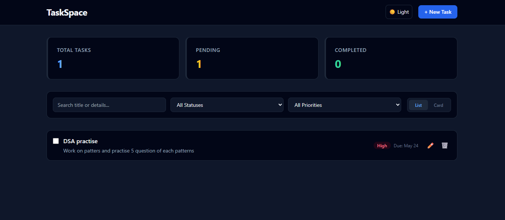
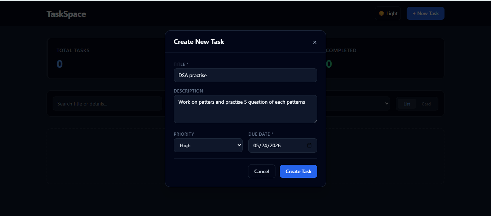
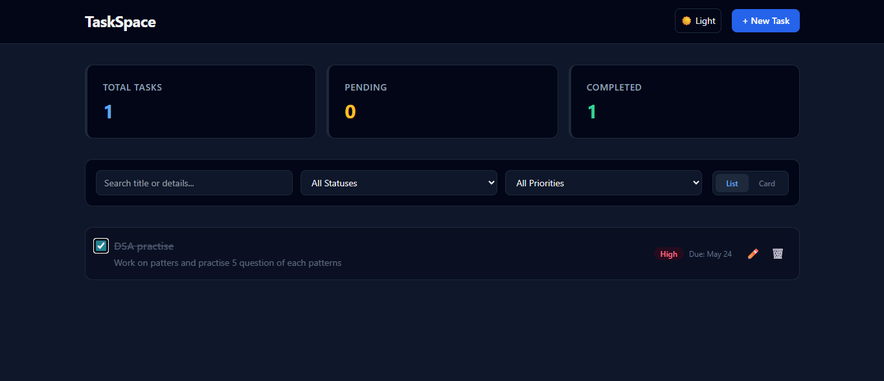
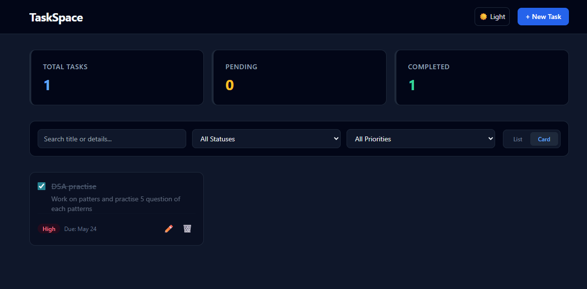

# TaskSpace - Task Manager Dashboard

A modern, feature-rich task management dashboard built with React, TypeScript, Vite, and Tailwind CSS. Organize your tasks efficiently with intuitive filtering, multiple view modes, and a polished dark mode.

## Features

✨ **Core Functionality**
- ✅ Create, read, update, and delete tasks
- 🔍 Advanced filtering by search, status, and priority
- 📊 Dashboard statistics showing task overview
- 💾 Persistent storage using localStorage
- 🎨 Responsive design with Tailwind CSS

🎯 **User Experience**
- 🌙 Light/Dark theme toggle with system preference detection
- 📱 Mobile-responsive layout
- 🎨 Multiple view modes (List, Grid, Card)
- ⚡ Smooth transitions and animations
- ♿ Semantic HTML and ARIA labels for accessibility

## Setup Instructions

### Prerequisites
- Node.js 16+ 
- npm or yarn

### Installation

1. **Clone or extract the project**
   ```bash
   cd Licious_Assessment
   ```

2. **Install dependencies**
   ```bash
   npm install
   ```

3. **Install Tailwind CSS and PostCSS** (if not already installed)
   ```bash
   npm install -D tailwindcss postcss autoprefixer
   ```

4. **Verify configuration files exist**
   - `tailwind.config.ts` - Tailwind configuration
   - `postcss.config.js` - PostCSS configuration
   - `vite-env.d.ts` - Vite type definitions

### Running the Development Server

```bash
npm run dev
```

The app will be available at `http://localhost:5173` (or another port if 5173 is busy).

### Building for Production

```bash
npm run build
```

This creates an optimized build in the `dist/` directory.

### Preview Production Build

```bash
npm run preview
```

## Project Structure

```
src/
├── App.tsx                 # Main application component
├── main.tsx               # React entry point
├── index.css              # Global styles (Tailwind)
├── types.ts               # TypeScript type definitions
├── components/
│   ├── DashboardStats.tsx # Statistics widget
│   ├── TaskFilters.tsx    # Filter controls
│   ├── TaskFormModal.tsx  # Create/edit task modal
│   ├── TaskItem.tsx       # Individual task component
│   └── ThemeToggle.tsx    # Dark mode toggle
├── vite-env.d.ts          # Vite type definitions
├── tailwind.config.ts     # Tailwind CSS config
└── postcss.config.js      # PostCSS configuration
```

## Design Decisions

### 1. **State Management**
- **Decision**: Used React's built-in `useState` and `useEffect` hooks instead of Redux/Zustand
- **Reasoning**: For a task manager of this scope, hook-based state is sufficient and reduces complexity. Data persists to localStorage for offline capability.

### 2. **Styling Approach**
- **Decision**: Tailwind CSS with utility classes
- **Reasoning**: Enables rapid UI development with consistent design tokens, smaller bundle size compared to CSS-in-JS, and excellent dark mode support.

### 3. **Dark Mode Implementation**
- **Decision**: Class-based dark mode with localStorage persistence
- **Reasoning**: 
  - Respects user's system preference on first visit
  - Persists choice across sessions
  - Avoids flash of unstyled content
  - Tailwind's `dark:` prefix provides clean utility classes

### 4. **Type Safety**
- **Decision**: Full TypeScript with strict mode enabled
- **Reasoning**: Catches type errors at development time, improves IDE autocomplete, makes refactoring safer.

### 5. **Data Persistence**
- **Decision**: localStorage-based storage with versioned keys
- **Reasoning**: 
  - No backend required for this assessment
  - Version key (`dashboard_tasks_v1`) allows easy migration
  - Suitable for client-side task management
  - Could be replaced with API calls later

### 6. **View Modes**
- **Decision**: Support for List, Grid, and Card views
- **Reasoning**: Provides flexibility for different use cases and screen sizes. Users can choose their preferred viewing experience.

### 7. **Filtering Strategy**
- **Decision**: Real-time filter application on the client side
- **Reasoning**: 
  - Instant feedback without network latency
  - Smooth UX with no loading states
  - Efficient for datasets of reasonable size

## Key Components

### TaskFormModal
Handles both create and edit operations with validation for title and description.

### DashboardStats
Displays:
- Total tasks count
- Completed tasks count
- Pending tasks count
- Overall completion percentage

### TaskFilters
Provides real-time filtering by:
- Search text (title & description)
- Status (All, Pending, Completed)
- Priority (All, Low, Medium, High)

### ThemeToggle
- Detects system preference on load
- Toggles `dark` class on `<html>` element
- Persists preference to localStorage

## Browser Support

- Chrome/Edge 90+
- Firefox 88+
- Safari 14+
- Mobile browsers (iOS Safari, Chrome Mobile)

## Performance Considerations

- ⚡ Vite's fast HMR (Hot Module Replacement) during development
- 📦 Tree-shaking removes unused code in production
- 🎯 CSS is optimized by PostCSS and Tailwind purges unused styles
- 🔄 localStorage operations are synchronous but minimal

## Future Enhancement Ideas

- 🗄️ Backend API integration with database
- 👥 User authentication and multi-user support
- 📧 Task notifications and reminders
- 📎 File attachments for tasks
- 🏷️ Tags and categories
- 📅 Calendar view
- ⏰ Recurring tasks
- 📤 Task sharing and collaboration
- 🔄 Sync across devices

## Technology Stack

- **React** 18.3 - UI library
- **TypeScript** 5.2 - Type-safe JavaScript
- **Vite** 5.3 - Build tool and dev server
- **Tailwind CSS** 3.4 - Utility-first CSS framework
- **PostCSS** 8.4 - CSS processing
- **Autoprefixer** 10.4 - Vendor prefixes

## License

This is an assessment project. Feel free to use as reference or starting point for your own projects.

## Support

For issues or questions, please check the component files in `src/components/` for implementation details.

## Screenshots

*Full dashboard showing statistics, filters, and task list in light mode*

### Create Task Modal

*Add new tasks with title, description, priority, and due date*

### Dashboard & Task List View

*View all tasks with statistics dashboard and list view layout*

### Task Completion

*Mark tasks as completed with visual feedback*

### Card View Mode

*Alternative card view layout for task display*
